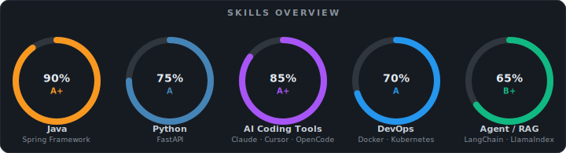

 

&nbsp;

&nbsp;

---

## 🧑‍💻 About Me | 关于我

I'm an **AI Coding & Agent developer** passionate about building intelligent developer tools and autonomous systems. Currently focused on exploring the frontier of LLM applications and agentic workflows.

> 专注于 **AI 编码工具**与**智能体开发**，热衷于探索大语言模型应用落地与开发者工具链创新。

- 🔭 **Working on:** Claude Code source code analysis & RAG system architecture
   &nbsp;&nbsp;&nbsp;&nbsp;*正在进行：Claude Code 源码解析 & RAG 系统架构设计*

- 🌱 **Learning:** Datawhale community content & Agent design patterns
   &nbsp;&nbsp;&nbsp;&nbsp;*正在学习：Datawhale 社区内容 & 智能体架构设计*

- 💬 **Ask me about:** Java · Python · AI Coding Tools · Agent Development

---

## 🛠️ Tech Stack | 技术栈

### Languages | 编程语言

### Frameworks & Infrastructure | 框架与基础设施

### AI Tools | AI 工具

---

## 📊 Skills Overview | 技能总览

**Rating Key | 评级说明:**

| Grade | Description |
|:-----:|-------------|
| **A+** | Highly proficient · 高度熟练，有大量实际项目经验 |
| **A**  | Proficient · 熟练掌握，能独立完成复杂任务 |
| **B+** | Competent & Growing · 能力持续成长中 |

---

## 📚 Currently | 当前动态

| | Topic | Description |
|---|---|---|
| 📖 | **Claude Code Source Analysis** | Deep-diving into the internals of Claude Code · 深度解析 Claude Code 内部实现 |
| 🤖 | **RAG Architecture** | Building production-ready RAG pipelines · 构建生产级 RAG 系统 |
| 🏫 | **Datawhale Community** | Following cutting-edge AI learning content · 学习前沿 AI 课程内容 |

---

## 📈 GitHub Stats | GitHub 统计

  
  

---

## 📫 Contact | 联系方式

> 📫 2361485765@qq.com
